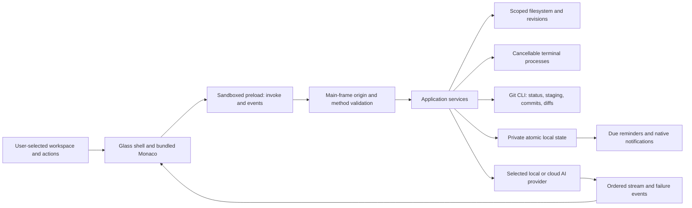

# Architecture

AuraScript is one desktop application. File, terminal, Git, persistence, and provider adapters run in its Electron main process. The renderer draws the interface and uses a small preload API. No Wednesday server or separately hosted backend is needed.

## Workspace and process boundary

Users choose new folders through the native folder picker. Reopening an explicit path is limited to previously selected workspaces. File APIs accept relative paths, reject paths outside the selected canonical directory, inspect symlink destinations, and protect `.git` internals. Text files have a 4 MB limit. Binary files produce a readable error.

Saves compare the recorded SHA-256 revision with the current disk bytes before replacing a file. Existing-file creation is exclusive. Search reads bounded real files and supports literal text rather than unbounded regular expressions. Replacement produces a preview, requires explicit selected files and matching revisions, and records its result.

Terminal commands are real operating-system processes in the selected workspace. They run only after an explicit confirmation. Cancellation stops the process tree and reports the terminal's real completion state. Git operates on the selected repository and keeps staging and committing visible.

These boundaries control application operations. The terminal is a shell: an explicitly approved command can perform any action allowed to the current operating-system account. Review commands before executing them.

## Persistence

The default profile is the operating system's application-data directory under `AuraScriptStudio`:

- Windows: `%APPDATA%\AuraScriptStudio`
- macOS: `~/Library/Application Support/AuraScriptStudio`
- Linux: the Electron application-data directory, usually `~/.config/AuraScriptStudio`

`state.json` stores versioned settings, recent workspaces, sessions, memories, document text, reminders, workflows, receipts, and process history. Writes use a temporary file, filesystem synchronization, and rename. The application preserves malformed state instead of silently replacing it with an empty profile. Retained deletions live in the profile's trash directory and can be restored into their original workspace.

Provider keys use Electron `safeStorage` when an encrypted operating-system backend is available. Keys never enter the renderer or the portable export. On Linux, the plain-text fallback backend is rejected. Operating-system encryption does not prevent other software running under the same account from accessing that account's data. See [Electron safeStorage](https://www.electronjs.org/docs/latest/api/safe-storage).

## Renderer and IPC

The application uses a private `aura://app` origin. Only renderer and bundled editor assets are served through the application protocol. Its content-security policy uses local scripts, local language workers, and no renderer network access. Navigation, popups, and webviews are restricted. `contextIsolation`, sandboxing, and disabled Node integration keep filesystem and provider access in the main process.

`window.aura.invoke(method, payload)` returns data or throws a structured error. `window.aura.onEvent(callback)` subscribes to terminal, assistant, workspace, and reminder events. Method names are allowlisted, payload sizes are bounded, and the main process accepts requests only from its own trusted main frame.

Microphone permission requires a user decision for a voice request. Automated headless acceptance denies native media permissions and does not claim hardware capture passed. See [Electron session permissions](https://www.electronjs.org/docs/latest/api/session).

## Intelligence

Provider adapters keep keys, HTTP calls, stream parsing, cancellation, and usage accounting outside the renderer. Selected context is bounded and derived from explicitly chosen files and retrieved local document text. Missing configuration, unsupported capabilities, and remote failures produce failed turns rather than fabricated answers.

Local retrieval uses bounded lexical search over stored text. It provides inspectable source excerpts; it is not presented as an embedding or semantic-search engine. Voice and vision use configured provider capabilities and cannot pass without the relevant engine or device.

The OpenAI-compatible streaming adapter follows the documented [streaming response](https://developers.openai.com/api/docs/guides/streaming-responses) and [Chat Completions](https://developers.openai.com/api/reference/resources/chat/subresources/completions/methods/create) event contracts. These references describe the adapter interface; they do not imply that a paid provider call has been run.

## Acceptance and releases

Node tests exercise pure boundaries and real service behavior in temporary directories. Electron acceptance runs both source and packaged applications against a copied public fixture repository and a fresh application profile. It asserts actual disk content, Git commits, process exits, saved local data, and visible light/dark rendering.

Fixtures, screenshots, and results are separate from normal user data. [Verification](VERIFICATION.md) records exact checks and open hardware/provider/platform gates.
